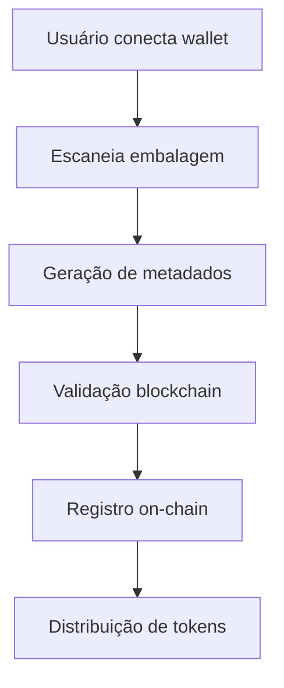

## E-COL — Web3 Recycling Infrastructure

<p align="center">
  
</p>

<p align="center">
  <b>Transformando embalagens recicláveis em ativos digitais rastreáveis na blockchain Solana.</b>
</p>

<p align="center">
  Sustentabilidade • Web3 • Solana • RWAs • Economia Circular
</p>

---

## Sobre o Projeto

O E-COL é uma infraestrutura Web3 de reciclagem construída na blockchain Solana.

O projeto transforma embalagens recicláveis em ativos digitais rastreáveis (RWAs), criando um ecossistema transparente de reciclagem com incentivos tokenizados.

A plataforma conecta:

- Sustentabilidade
- Blockchain
- Wallets Web3
- Tokenização
- Economia Circular
- Incentivos digitais

---

## Problema

O sistema atual de reciclagem enfrenta diversos desafios:

- Falta de rastreabilidade das embalagens
- Baixo incentivo para consumidores
- Pouca transparência no processo
- Baixa valorização de recicladores
- Dificuldade de validação ambiental

Milhões de resíduos recicláveis deixam de gerar impacto econômico e ambiental positivo.

---

##  Solução

O E-COL transforma resíduos recicláveis em registros digitais verificáveis na blockchain.

Fluxo da solução:

1. Usuário conecta wallet Solana
2. Escaneia embalagem reciclável
3. Metadados são gerados
4. Evento é validado on-chain
5. Recompensas são distribuídas
6. O impacto ambiental se torna rastreável

---

## Arquitetura Blockchain

### Solana Network

A infraestrutura utiliza Solana devido a:

- Alta escalabilidade
- Baixo custo de transação
- Alta velocidade
- Eficiência energética

---

### Smart Contracts

Os smart contracts são responsáveis por:

- Validar eventos de reciclagem
- Registrar transações ambientais
- Gerar recompensas tokenizadas
- Associar wallets aos ativos recicláveis
- Garantir rastreabilidade on-chain

---

### Wallet Integration

Arquitetura preparada para:

- Phantom Wallet
- Solflare
- Wallet Adapter APIs
- Assinatura de transações
- Validação de identidade Web3

---

## RWAs (Real World Assets)

Cada embalagem reciclável pode se tornar:

- Um ativo digital rastreável
- Uma prova verificável de reciclagem
- Um registro ambiental imutável
- Um evento tokenizado

O E-COL conecta resíduos físicos à blockchain através da tokenização de ativos reais.

---

## Stack Técnica

### Mobile Application

- React Native
- Expo
- JavaScript

---

### Web3 Layer

- @solana/web3.js
- SPL Tokens
- Wallet Adapter APIs

---

### Blockchain

- Solana
- Smart Contracts
- On-chain Validation
- Tokenized Rewards

---

### Frontend Web

- React
- TailwindCSS

---

### Deploy

- Vercel

---

## Funcionalidades

- Scanner de embalagens
- Sistema de recompensas
- Wallet Solana
- Rastreamento ambiental
- Ranking gamificado
- Tokens e incentivos
- Histórico de transações

---

## Fluxo da Aplicação



---

## Como Rodar o Projeto

### Instalar dependências

```bash
npm install
```

### Rodar aplicação Expo

```bash
npx expo start
```

### Limpar cache do Expo

```bash
npx expo start -c
```

---

## Visão do Projeto

Construir uma infraestrutura global de reciclagem baseada em blockchain, onde resíduos recicláveis se tornam ativos ambientais digitais rastreáveis.

---

## Categorias do Hackathon

- Solana Ecosystem
- Web3 Infrastructure
- Blockchain
- Tokenização
- RWAs
- Sustentabilidade
- Economia Circular

---

## Equipe

### E-COL Team 

Projeto desenvolvido para hackathon focado em:
- Blockchain
- Solana
- Sustentabilidade
- Tokenização de ativos reais
- Web3

---

### 📄 Licença

MIT License
